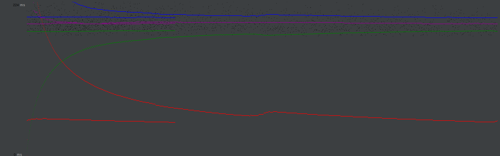
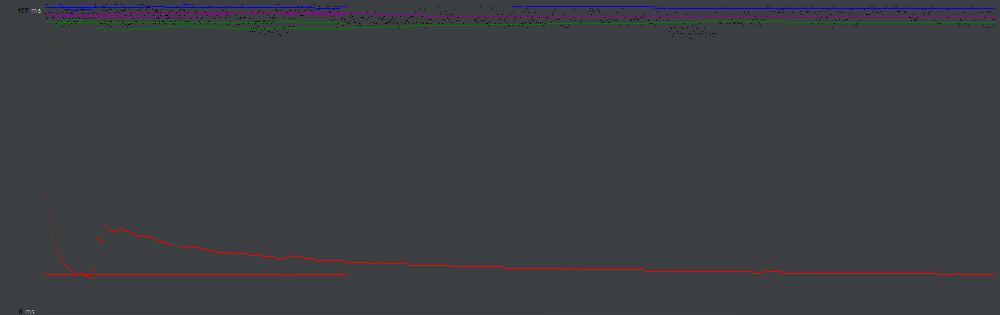

## CS 122B Project 

- # General
    - #### Team#: 135
    
    - #### Names: Yiming Wang, Jiangtong Wang
    
    - #### Project 5 Video Demo Link: https://youtu.be/s80moZ58Ajc
      - (backup link: https://www.youtube.com/channel/UCQrlWlCyCoJByZDycrHVK2Q)

    - #### Instruction of deployment:
     ##### Use web page/command line

        - Produce the WAR file on development machine / Use mvn command to produce WAR file 
        - Move the WAR file to the directory of tomcat, then connect to tomcat server and login to the manager page
        - Deploy the WAR file and run it
     
     ##### With Tomcat

        - Use command line to build the project

        - Make sure the https settings are all right for Tomcat

        - Deploy the war file on Tomcat server

    ##### With Android

        - Open the project in IntelliJ IDEA
        - select the SDK for the project, in this project we use java 1.8 with android API 28.
        - Select an emulator
        - Build and run the project

    ##### Fuzzy Text Search

        - We consider that the distance of words should be affected by the length of input string, by this way we can make sure that it is only a typo.

        - For example, if a word has only two letters, it is impossible to give any distance for it because it may be different from what we want to input. ("it" should not be redirected to "is")

        - Finally we decide the distance of words should be 1/5 of the input length.

    - #### Collaborations and Work Distribution: 
        - Yiming Wang: T1, T2, T3, T4
        - Jiangtong Wang: T1, T2, T3, T4
        - Check all tasks, debug and write Readme.md together

- # Connection Pooling
    - #### Include the filename/path of all code/configuration files in GitHub of using JDBC Connection Pooling.
    
        - AddActionServlet
        - ConfirmationServlet
        - dashboardLoginServlet
        - dashboardServlet
        - LoginServlet
        - MainpageServlet
        - MovieListServlet
        - MovieSuggestion
        - PaymentServlet
        - SingleMovieServlet
        - SingleStarServlet
    
    - #### Explain how Connection Pooling is utilized in the Fabflix code.
        - Prepare the Resource for Connection Pooling (allocating a pool of connections)
        - Get the initial context
        - Look up the resource for connection pooling
        - Get a connection from the pool and use it
        - Close the connection and the connection will be put back to pool for future use
    
    - #### Explain how Connection Pooling works with two backend SQL.
        - Pre-created a pool of connections
        - Every time we decide a data source to use and create a connection, we will get a connection from the pool
        - Use the connection to do operation with data
        - Close the connection and it will be put back to the pool which we get it for future use
    

- # Master/Slave
    - #### Include the filename/path of all code/configuration files in GitHub of routing queries to Master/Slave SQL.
        - AddActionServlet
        - ConfirmationServlet
        - dashboardLoginServlet
        - dashboardServlet
        - LoginServlet
        - MainpageServlet
        - MovieListServlet
        - MovieSuggestion
        - PaymentServlet
        - SingleMovieServlet
        - SingleStarServlet

    - #### How read/write requests were routed to Master/Slave SQL?
        - Define two data sources for Local SQL and Master SQL
        - All the read requests will be sent to the Local SQL which use the URL of Local SQL
        - All the write requests will be sent to the Master SQL, Local SQL will do the same operation so the data will be the same
    

- # JMeter TS/TJ Time Logs
    - #### Instructions of how to use the `log_processing.*` script to process the JMeter logs.
      - Download the logfile from AWS. The logfile will be written to the context directory -> /home/ubuntu/tomcat/webapps/PROJECT_NAME/timeTestLogs/. Logfiles splited on Master machine and Slave machine and need to combine together when calculating ts and tj time should be put in one same child directory.
      - Edit the contextPath in log_processing.py. The contextPath should be the root path of local logfile directory which contains all logfiles. 
      - Run log_processing.py. The script is under ./CS122B_Fabflix/src/funcScripts. The script will output the current processing logfile name and its tj / ts time.
       ※ Accroding to piazza post, we disable login filter to do the tests.

- # JMeter TS/TJ Time Measurement Report
    - Analysis for all results: Average search servlet time is always longer than average JDBC time, because serach servlet calculates the time to run the whole doGet method, while the average JDBC time only calculates the time to do JDBC related operations (connects to the database, execute queries, get results) . Average Query time is also always longer than average search servlet time, because it calculates the time to send and receive the whole request. Some time will also be wasted on dealing with JMeter GUI, which makes average query time higher than it should be. Besides, the time we got in these cases is not absolute; possibilities (though they might not be very influential) such as the internet fluctuation, thread blocking on Tomcat, and throughput limitation on AWS exist and might cause fluctuation in measuring opeartion time.

| **Single-instance Version Test Plan**          | **Graph Results Screenshot** | **Average Query Time(ms)** | **Average Search Servlet Time(ms)** | **Average JDBC Time(ms)** | **Analysis** |
|------------------------------------------------|------------------------------|----------------------------|-------------------------------------|---------------------------|--------------|
| Case 1: HTTP/1 thread                          |    | 196                         | 137.23                                  | 134.77                        |  Though this test uses pool which can save some time, it uses only 1 thread. One thread might not use the system very efficiently because the system cannot optimize operation, and this may make the time on requests higher than 10 threads case.           |
| Case 2: HTTP/10 threads                        |     | 378                         | 127.85                                  | 126.21                        | This test case uses 10 threads so that its ts time and tj time can be expected to be shorter than 1 thread case, because with different threads the system can optimize operations and increase efficiency. For average query time, JMeter might spend some time to combine the results of all 10 threads and trace their redirections. Also, other possibility of fluctuation might also influence the results.            |
| Case 3: HTTPS/10 threads                       |     | 201                         | 165.07                                  | 163.01                        | This test case uses 10 threads but HTTPS protocol so that its ts and tj time can be expected to be longer. HTTPS has encryption/decryption overhead so it can be slightly slower. However, for JMeter perspective, because the server will no longer redirect the request, the average query time can be expected to be shorter in this aspect. The time can also be influenced by other results.           |
| Case 4: HTTP/10 threads/No connection pooling  |     | 196                         | 128.77                                  | 127.30                        | This test case doesn't use pool so it can be expected it might be slower than case 2, the one use pool. Pooling saves time because servlet doesn't need to establish whole new connections every time but uses available connections from the pool. Still, establishing and destroying directly might save some time in managing these connections in the pool, but the time saved might not be as much as time wasted in the whole process.           |

- Analysis for all scaled version tests: Increasing the number of servers increases the efficiency and ability of the whole system to process requests. Therefore, though still influenced by the number of threads, the responding time might be somehow shorter and the server should be able to process more requests at one time.

| **Scaled Version Test Plan**                   | **Graph Results Screenshot** | **Average Query Time(ms)** | **Average Search Servlet Time(ms)** | **Average JDBC Time(ms)** | **Analysis** |
|------------------------------------------------|------------------------------|----------------------------|-------------------------------------|---------------------------|--------------|
| Case 1: HTTP/1 thread                          |     | 196                         | 127.51                                  | 125.04                        | Though this case uses pool, it only uses 1 thread so that the multithreading optimization and multi-server optimization might not be utilized very well, which means the efficiency of the whole system will decrease and the responding time can be expected to increase.           |
| Case 2: HTTP/10 threads                        |     | 193                         | 113.47                                 | 112.08                        | This case uses pool and 10 threads to run queries. This time we have two servers to deal with requests and therefore they should be able to better handle more requests at a time, the execution time can be expected to be somehow shorter.          |
| Case 3: HTTP/10 threads/No connection pooling  |     | 196                         | 120.72                                 | 118.70                        | This case doesn't use pool, so compared to case 2, it can be expected that it will have longer time to run because it has to establish new connections every time.         

